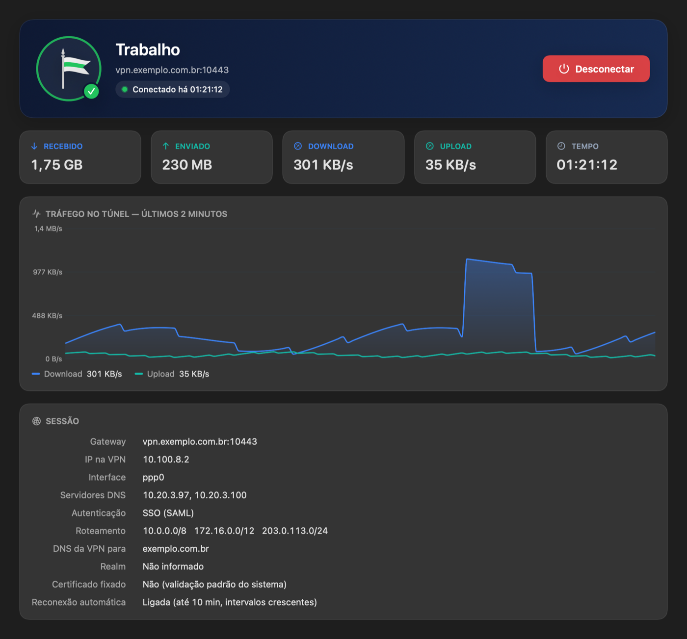

<p align="center">
  
</p>

<h1 align="center">Geleit</h1>

<p align="center">
  A modern, split-tunnel client for Fortinet SSL-VPN gateways — SSO included.
</p>

<p align="center">
  
</p>

---

*Geleit* (German for "safe conduct", the armed escort that guaranteed safe passage along a road) is a lightweight VPN client for **FortiGate SSL-VPN** gateways. It sends **only the networks you choose** through the tunnel, resolves **only the domains you choose** with the VPN's DNS, and leaves everything else on your regular connection.

It is built on top of [openfortivpn](https://github.com/adrienverge/openfortivpn) and adds what the command line does not: a native interface, browser-based SSO, saved connections, live traffic monitoring and automatic reconnection.

## Features

- **Split tunnel by design**: list the networks (CIDR) that go through the VPN; the rest of your traffic is untouched. A "full tunnel" mode is also available.
- **Split DNS**: only the domains you list are resolved by the VPN's DNS servers.
- **SSO (SAML) in your browser**, plus username/password authentication (passwords stored in the Keychain).
- **One click from the menu bar**: pick a saved connection and the login starts.
- **Live traffic**: bytes received/sent, current throughput and a two-minute chart.
- **Automatic reconnection** with exponential backoff (5 s, 10 s, 20 s…) for up to 10 minutes. Each attempt first checks that the gateway is reachable. With SSO, the session cookie is reused when it is still valid; when the gateway has ended the session, Geleit signs in again through the browser, which usually completes on its own while your identity provider session is alive.
- **Certificate pinning** (SHA-256) for gateways with self-signed certificates.
- Clean teardown: routes and DNS entries are removed when you disconnect or quit.

## Clients

This is a monorepo meant to host one client per platform, sharing the same profile format and protocol notes in [`spec/`](spec/).

| Platform | Status | Path |
|---|---|---|
| macOS 14+ (Apple Silicon and Intel) | ✅ Working | [`apps/macos`](apps/macos) |
| Windows | Planned | — |
| Linux | Planned | — |

## Quick start (macOS)

### Download

**[⬇ Geleit-macOS.zip](https://github.com/Tools-4-US/split-vpn/releases/latest/download/Geleit-macOS.zip)** — universal (Apple Silicon and Intel), macOS 14+. All versions on the [Releases](https://github.com/Tools-4-US/split-vpn/releases) page, each with a SHA-256 checksum.

```bash
brew install openfortivpn
# unzip and move Geleit.app to /Applications, then:
xattr -dr com.apple.quarantine /Applications/Geleit.app               # app is ad-hoc signed, not notarized
sudo "/Applications/Geleit.app/Contents/Resources/install-helper.sh"   # one-time, see "Security model"
```

Instead of `xattr`, you can open the app once and allow it under **System Settings → Privacy & Security → Open Anyway**.

### Build from source

```bash
brew install openfortivpn
git clone https://github.com/Tools-4-US/split-vpn.git geleit
cd geleit/apps/macos
./build.sh --install                                                   # builds and copies Geleit.app to /Applications
sudo "/Applications/Geleit.app/Contents/Resources/install-helper.sh"
```

Open **Geleit**, click **+**, fill in your gateway and the networks to route, and connect from the window or the menu bar. Details in [`apps/macos/README.md`](apps/macos/README.md).

## Security model

Changing routes, DNS resolvers and starting `openfortivpn` require root. Instead of asking for your password on every connection, Geleit installs a **single root-owned helper** (`/usr/local/libexec/geleit-helper`) and a `sudoers` rule that allows your user to run **only that helper** without a password.

Because anything running as your user can call it, the helper treats every argument as untrusted: hostnames, ports, CIDRs, IPs, domains and interface names are validated against strict patterns, and nothing is passed through to `openfortivpn` verbatim (options such as `pppd-plugin` are never reachable). Secrets (SSO cookie or password) travel over stdin, never on the command line, and the generated `openfortivpn` config is root-only and deleted when the tunnel closes. DNS resolver files are only overwritten or removed if Geleit created them.

See [`SECURITY.md`](SECURITY.md) to report a vulnerability.

## Contributing

Issues and pull requests are welcome. Dependencies are kept up to date by Dependabot; `openfortivpn` itself is installed through Homebrew, so a weekly workflow opens an issue whenever a new upstream version needs testing.

## License

[MIT](LICENSE). Geleit is not affiliated with or endorsed by Fortinet. FortiGate and FortiClient are trademarks of Fortinet, Inc.
